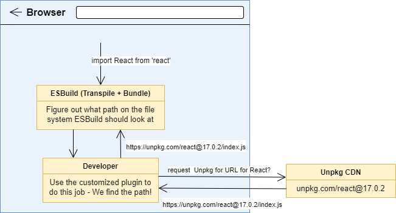
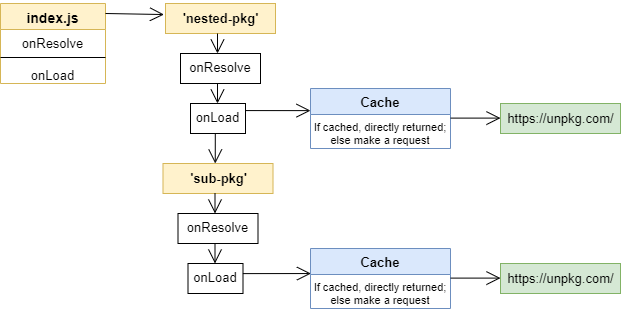
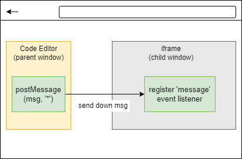
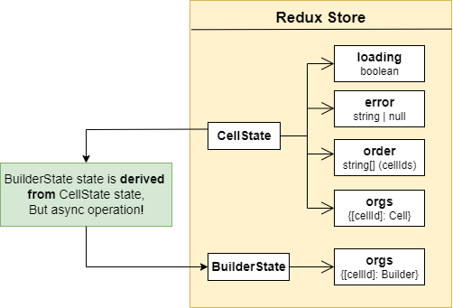

### Code Book

#### Note

- if a specific version is need, jsut append the version to the package name with `@`
  - e.g., `import React from 'react@16.0.0'`

###### Constraints

- importing NPM packages has limitations
  - modules that are worked in a node env
  - modules that require CSS file or font files

#### Challenges

- User input code is `String`, which should be interpreted safetly to execute
  - compilation error or runtime error should not crash the entire App
- In addition to pure `JS` syntax, `JSX` needs some preprocessing for the browser to understand
- Integrated with `modules`, either `CommonJs` or `ES Modules` syntax should be understood before executing the code
  - self-defined modules
  - online NPM packages
  - CSS styling code

#### Design Choices

##### A. Transpile + Bundle

- How to _transpile_
  - option 1: outsource **remote** backend server API to run Babel
  - option 2: **in-browser** transpiler as the foundation
- How to _bundle_ modules

  - `Webpack` bundler, taking multiple different modules, combining them all together and linking them into a single file
    - option 1: running `Webpack` on the **remote server**, interpose own customized plugin to make a request to `NPM Registry`, return the source code for the bundling process on the remote server
      - Actually, using **`unpkg` public CDN**, as requesting directly to `NPM` cause _CORS issue_
    - option 2: maintaining the above logic in the **loacl React App** with customized plugin for changing `Webpack` behavior

  ###### Reasoning

  - Remote procedure
    - download and cache NPM packages on the remote server => bundle for multiple users more quickly
    - better support for different devices and low bandwidth cases
      - extra request to remote server is unavoidable
  - Local procedure
    - faster code execution (save waiting time)
    - no need to maintain the logic for connecting remote server
    - simplicity, also as no commercial use
      - so for any developer, just run the infrastructure and use the tool
  - Conclusion - using **Local Design** - in addition, using `ESBuild` instead of `Webpack` as it cannot be used in the browser - `ESBuild` supports in-browser transpiling and bundling - way much faster (written as Go underneath, translate JS into web assembly binary)

    

- Issuse with _`CSS` files_
  - as we do not write the output to some files
    - this is the <u>downside of **Local Design**</u> as browser does not have a file system
      > ESBuild can only spit out JS files directly from the bundling if no writing to the hard disk
  - workaround: **using JS to append CSS** style into DOM
    - take CSS file and **wrap** it with some JS code

---

##### B. Caching packages

- every time fetching pkgs, first check if files have already been cached
  

---

##### C. Code Execution

- Issues
  - DOM manipulation
  - Catch errors or infinite execution to avoid crashing
  - Malicious Attack - `event listener, Cookie`
- Solution: `iframe`
  - the 1st and 2nd ones can be directly solved with `<iframe>` as they will not directly affect the parent React Application
  - the 3rd one can be achieved by disabling the direct communication between frames
  - option 1: using `sandbox=""` to disable the direct communication between parent and child frames
  - option 2: rendering `iframe` using a different `domain` / `port` with that used by the parent React App
  ###### Reasoning
  - some considerations
    - this app does not have any authentication mechanism
    - no big security issues are concerned here
  - option 1 -> burdens the infrastructure setup, execute quickly
  - option 2 -> some features like `localStorage, Cookie, ...` are disabled but simple
- **Tricky points**

  - use `srcDoc` instead of `src` to save extra requests
  - **apply `window.postMessage + eval(${code})`** to lightly enable cross-domain communication (directly execute code)
    - **as opposed to** the combination of `srcDoc = ` with just string literal (executed by `<script>` tag invocatoin)
      - `srcDoc` attribute may have length limitation
      - ❌pure string literal may have special chars that _need to be escaped_
  - ✅ **[Tradeoff]**: still considered as secure -- as it's hard for `iframe` child window to reach out to the parent window

    - hard to set up event listeners onto parent
    - hard to read `cross-domain` disabled values

    

---

##### D. Redux State Store

- Cell (code / markdown cell)
  - `loading: boolean`: whether fetch data
  - `error: string | null`
  - `order: string[]`: cell ids
  - `orgs: {[id]: cell}`: object storing all cells
- Builder
  - `orgs: {[id]: cell}`: object storing each cell's builder
- **[Tradeoff]**

  - `Builder` is associated with each `Cell`, which can be taken as <u>a derived state</u> of `Cell`
    - Typically, this is when we should use `useSelector()` to handle the derived state
  - BUT! this process is **asynchronous** => better not use `useSelector()` (may try `useAsyncSelector` from 3rd-party pkg)

  
