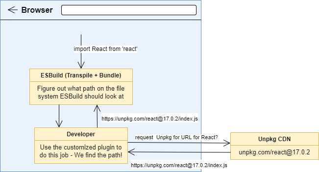
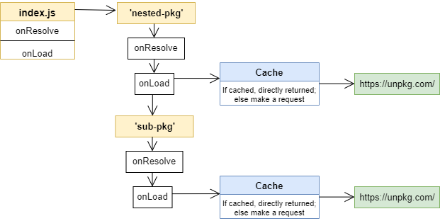
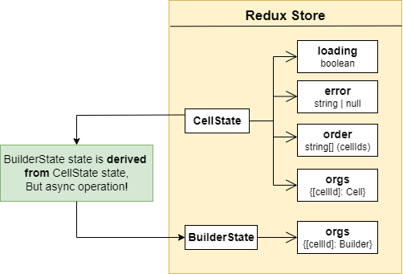

## Code Book

This is an **interactive browser-based JS coding and text editing** React Application. The coding part mimics the famous services like `CodePen` or `CodeSandBox`, but the code **`bundling and transpiling`** are done directly in the browser. Currently, the coding editor supports CommonJS and ES6 Modules syntax, and it does not support other frameworks, e.g., Vue or Angular.

There are two special functions: `printf() and render()`.

- `printf()` is like `console.log()`, which <u>directly shows the result</u> in the `Preview`
  - if `val` is a reference val, `printf(val)` prints out its stringify format
- `render()` is like `React.createElement()`, which <u>directly renders the JSXElement</u> onto the `Preview`
  - when using this function, there is no need to `import` React/ReactDOM explicitly as it already supports them

If multiple code cells are created, the execution follows the **cumulative code rule**. A code cell can access all the global objects defined in its previouse (above) cells.

###### Constraints

- importing NPM packages has limitations
  - some modules that are required to worked in a node env
  - some modules that require CSS files or font files

#### How To Start

- in the project root directory
  - `npm run start-dev` starts up the app in `development` mode while `npm run start-prod` starts it up in the `production` environment
- to run `CLI`, in `cli/dist`, in a separate terminal
  - `node index.js serve` serves the application and creates a default file `coolbook.js`
    - `coolbook.js` is a file that stores all the editors content and metadata in JSON format
  - `node index.js serve <filename>` customizes the app using the given file specified by this `filename`
  - `node index.js server --port <portnumber>` runs the server on the specified port
    - in `development` mode, both ports `3000` & `<portnumber>` can serve the app (same instance)
    - in `production` mode, only specified `<portnumber>` has access to the server; otherwise, default port `8017` is used
  - `node index.js --help` gives information about the usage of this interface

#### Challenges

- User input code is `String`, which should be interpreted safetly to execute
  - compilation error or runtime error should not crash the entire App
- In addition to pure `JS` syntax, `JSX` needs some preprocessing for the browser to understand
- Integrated with `modules`, either `CommonJs` or `ES Modules` syntax should be understood before executing the code
  - self-defined modules
  - online NPM packages
  - CSS styling code

#### Design Choices

##### A. Transpile + Bundle

- How to _transpile_
  - option 1: outsource **remote** backend server API to run Babel
  - option 2: **in-browser** transpiler as the foundation
- How to _bundle_ modules

  - `Webpack` bundler, taking multiple different modules, combining them all together and linking them into a single file
    - option 1: running `Webpack` on the **remote server**, interpose own customized plugin to make a request to `NPM Registry`, return the source code for the bundling process on the remote server
      - Actually, using **`unpkg` public CDN**, as requesting directly to `NPM` cause _CORS issue_
    - option 2: maintaining the above logic in the **loacl React App** with customized plugin for changing `Webpack` behavior

  ###### Reasoning

  - Remote procedure
    - download and cache NPM packages on the remote server => bundle for multiple users more quickly
    - better support for different devices and low bandwidth cases
      - extra request to remote server is unavoidable
  - Local procedure
    - faster code execution (save waiting time)
    - no need to maintain the logic for connecting remote server
    - simplicity, also as no commercial use
      - so for any developer, just run the infrastructure and use the tool
  - Conclusion - using **Local Design** - in addition, using `ESBuild` instead of `Webpack` as it cannot be used in the browser - `ESBuild` supports in-browser transpiling and bundling - way much faster (written as Go underneath, translate JS into web assembly binary)

    

- Issuse with _`CSS` files_
  - as we do not write the output to some files
    - this is the <u>downside of **Local Design**</u> as browser does not have a file system
      > ESBuild can only spit out JS files directly from the bundling if no writing to the hard disk
  - workaround: **using JS to append CSS** style into DOM
    - take CSS file and **wrap** it with some JS code

---

##### B. Caching packages

- every time fetching pkgs, first check if files have already been cached
  

---

##### C. Code Execution

- Issues
  - DOM manipulation
  - Catch errors or infinite execution to avoid crashing
  - Malicious Attack - `event listener, Cookie`
- Solution: `iframe`
  - the 1st and 2nd ones can be directly solved with `<iframe>` as they will not directly affect the parent React Application
  - the 3rd one can be achieved by disabling the direct communication between frames
  - option 1: using `sandbox=""` to disable the direct communication between parent and child frames
  - option 2: rendering `iframe` using a different `domain` / `port` with that used by the parent React App
  ###### Reasoning
  - some considerations
    - this app does not have any authentication mechanism
    - no big security issues are concerned here
  - option 1 -> burdens the infrastructure setup, execute quickly
  - option 2 -> some features like `localStorage, Cookie, ...` are disabled but simple
- **Tricky points**

  - use `srcDoc` instead of `src` to save extra requests
  - **apply `window.postMessage + eval(${code})`** to lightly enable cross-domain communication (directly execute code)
    - **as opposed to** the combination of `srcDoc = ` with just string literal (executed by `<script>` tag invocatoin)
      - `srcDoc` attribute may have length limitation
      - ❌pure string literal may have special chars that _need to be escaped_
  - ✅ **[Tradeoff]**: still considered as secure -- as it's hard for `iframe` child window to reach out to the parent window

    - hard to set up event listeners onto parent
    - hard to read `cross-domain` disabled values

    

---

##### D. Redux State Store

- Cell (code / markdown cell)
  - `loading: boolean`: whether fetch data
  - `error: string | null`
  - `order: string[]`: cell ids
  - `orgs: {[id]: cell}`: object storing all cells
- Builder
  - `orgs: {[id]: cell}`: object storing each cell's builder
- **[Tradeoff]**

  - `Builder` is associated with each `Cell`, which can be taken as <u>a derived state</u> of `Cell`
    - Typically, this is when we should use `useSelector()` to handle the derived state
  - BUT! this process is **asynchronous** => better not use `useSelector()` (may try `useAsyncSelector` from 3rd-party pkg)

  

---

#### When things become larger...

- Package-based development
  - CLI: start up the local-server API
  - Local-server Express API: serve up the React App & save/load editor cells from a file
    - **`simulation of the production env`**
    - send the **built production** files of the React App to the browser -- `dist/*`
    - **fetch (GET)** editor cells info from the file and send them back `filename from CLI`
    - **store/update (POST)** the cells info back to the file
  - React App: make the production assets available to the local API
- tool: `Lerna`
  - WHY? avoid republishing packages to NPM registry and outsourcing them (new versions) again
    - `leran` sets up a link from `node_modules/` over to the copy of the package on the local machine
    - changes in the dependent package will be directly reflected in the current package
  ###### Reasoning
  - each package can easily specify another as a dependency
  - similar logic can be shared among different packages
    - can extract logic and outsource it
